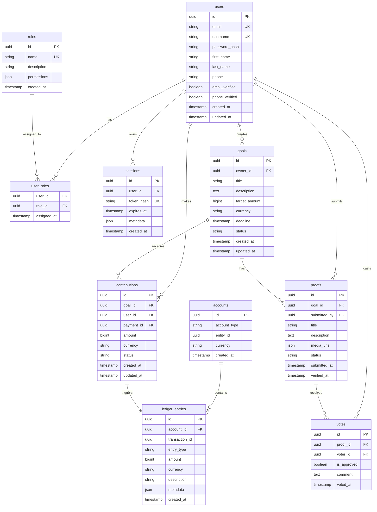
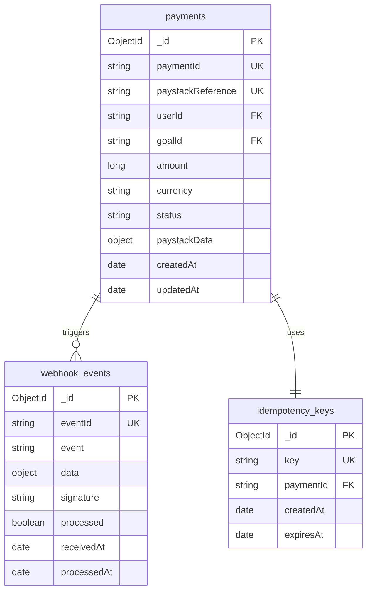
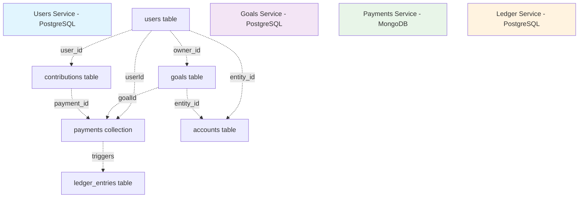

# Database Schema Design

## Overview

This document outlines the complete database schema for all GoFund services, including PostgreSQL tables and MongoDB collections.

## Entity Relationship Diagram

## MongoDB Collections (Payments Service)

## Cross-Service Relationships

## Detailed Table Specifications

### Users Service Tables

#### users
- **Purpose**: Store user account information
- **Key Constraints**: 
  - Unique email and username
  - Password must be hashed
  - Email/phone verification flags

#### roles & user_roles
- **Purpose**: Role-based access control (RBAC)
- **Key Features**:
  - Many-to-many relationship between users and roles
  - JSON permissions for flexible authorization

#### sessions
- **Purpose**: Authentication session management
- **Key Features**:
  - Token-based authentication
  - Automatic expiration
  - Metadata for device tracking

### Goals Service Tables

#### goals
- **Purpose**: Core goal definitions
- **Key Features**:
  - Monetary targets with currency support
  - Status tracking (OPEN, FUNDED, WITHDRAWN, etc.)
  - Deadline enforcement

#### contributions
- **Purpose**: Track user contributions to goals
- **Key Features**:
  - Links to payment records via payment_id
  - Status tracking for contribution lifecycle

#### proofs & votes
- **Purpose**: Community verification system
- **Key Features**:
  - Proof submission with media support
  - Democratic voting mechanism
  - Approval thresholds

### Ledger Service Tables

#### accounts
- **Purpose**: Account management for double-entry bookkeeping
- **Account Types**: USER, GOAL, ESCROW, REVENUE
- **Key Features**:
  - Multi-currency support
  - Entity polymorphism (users, goals, etc.)

#### ledger_entries
- **Purpose**: Immutable financial transaction log
- **Entry Types**: DEBIT, CREDIT
- **Key Features**:
  - Append-only design
  - Rich metadata for audit trails
  - Balance calculation via aggregation

### Payments Service Collections

#### payments
- **Purpose**: Payment processing and status tracking
- **Key Features**:
  - Paystack integration data
  - Payment state machine
  - Cross-service references (userId, goalId)

#### webhook_events
- **Purpose**: Webhook processing and deduplication
- **Key Features**:
  - Raw Paystack webhook storage
  - Processing status tracking
  - Signature verification data

#### idempotency_keys
- **Purpose**: Prevent duplicate payment processing
- **Key Features**:
  - TTL expiration (24 hours)
  - Unique constraint enforcement
  - Payment correlation

## Data Flow Example

1. **User creates goal**: `users.id` → `goals.owner_id`
2. **User contributes**: Creates `contributions` record with `payment_id`
3. **Payment processed**: `payments` collection stores Paystack data
4. **Payment verified**: Creates `ledger_entries` for double-entry bookkeeping
5. **Goal funded**: Status updated when target reached
6. **Proof submitted**: `proofs` table with community voting
7. **Funds released**: Additional `ledger_entries` for withdrawal

This schema ensures data consistency, audit trails, and proper separation of concerns across microservices.